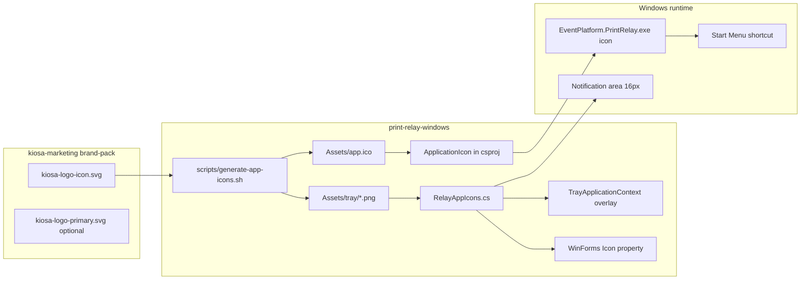

# Sprint 4 — Kiosa brand icon integration plan

**Story:** W-01-S12 · **Sprint:** 4 · **FR:** FR-001  
**Sprint board:** [`SPRINT.md`](../../SPRINT.md#sprint-4--kiosa-brand-icons-fr-001)  
**Acceptance:** [`BACKLOG.md`](../../BACKLOG.md) — W-01-S12

## Source assets and rules

**Source of truth:** `kiosa-marketing/brand-pack/` (sibling repo on developer machine)

| File | Use in this project |
|---|---|
| `kiosa-logo-icon.svg` | **Primary** — tray, `.exe` icon, WinForms title bars, Task Manager |
| `kiosa-logo-primary.svg` | Optional — setup wizard header (if space allows; min 120px wide per brand pack) |
| `kiosa-logo-monochrome.svg` | Fallback reference only if 16×16 tray accent is unreadable in testing |
| `Kiosa_Brand_Pack.md` | Rules: no shadows/gradients; icon-only below wordmark sizes; accent may blur below 24px |

Brand pack open item (section 8) notes ICO/PNG exports are **not yet generated** — we generate them in this repo from the SVG.

**Naming stays as-is:** window and installer text remains "Event Platform Print Relay" / "Print Relay"; only visuals switch to Kiosa.

---

## Current gaps in this repo

`TrayApplicationContext.CreateIcon` clones `SystemIcons` (Warning / Error / Information) — not Kiosa branding.

- No `ApplicationIcon` in `EventPlatform.PrintRelay.App.csproj` — `.exe` and Start Menu shortcut inherit Windows default icon.
- Forms (`SetupWizardForm`, `StatusForm`, `SettingsForm`) do not set `Icon`.
- PRD §7.1 colour states (green / amber / red / grey) are not implemented; only 3 enum values exist in `RelayTrayIconState`.
- WiX `Package.wxs` Start Menu shortcut has no explicit `Icon` — it will pick up the embedded exe icon once `ApplicationIcon` is set.

---

## Target architecture



**Tray state approach:** keep the Kiosa icon; draw a small status dot (PRD colours: green `#16A34A`, amber `#D97706`, red `#DC2626`, grey `#78716F`) in the bottom-right corner at runtime via `System.Drawing`. Cache one `Icon` per state; dispose on swap (existing pattern in `AssignTrayIcon`).

---

## Asset layout (new files)

```
src/EventPlatform.PrintRelay.App/Assets/brand/
  kiosa-logo-icon.svg          # copied from kiosa-marketing (source reference)
  kiosa-logo-primary.svg       # optional wizard header
  app.ico                      # generated: 16, 32, 48, 256
  tray/
    base-32.png                # generated from SVG at 32px (overlay source)
scripts/
  generate-app-icons.sh        # reproducible SVG → PNG → ICO (rsvg-convert or Inkscape + ImageMagick)
```

Commit the **generated** `.ico` and PNGs so Windows CI/build does not need SVG tooling. Document regeneration in script header.

---

## Implementation sessions

Work is split for the **Mac agent ↔ Windows operator** handoff model: each agent session ends with a push; Windows verification is **one step per reply**.

### Session 1 — Assets + base icon wiring (Mac agent)

**Goal:** Kiosa icon everywhere that does not need live state logic.

1. Copy SVGs from `kiosa-marketing/brand-pack/` into `Assets/brand/`.
2. Add `scripts/generate-app-icons.sh`; run on Mac to produce `app.ico` + `tray/base-32.png`.
3. Update `EventPlatform.PrintRelay.App.csproj`:
   - `<ApplicationIcon>Assets\brand\app.ico</ApplicationIcon>`
   - Embed tray PNGs as resources (`EmbeddedResource` or `Content` with copy).
4. Add `RelayAppIcons.cs` in App project:
   - `LoadAppIcon()` from embedded `app.ico`
   - `CreateTrayIcon(RelayTrayIconState)` — initially return base icon only (overlay in Session 2).
5. Replace `CreateIcon` / `SystemIcons` usage in `TrayApplicationContext.cs`.
6. Set `Icon = RelayAppIcons.LoadAppIcon()` on Setup, Status, Settings forms.
7. Log decision in `DECISIONS.md` (asset source, overlay strategy, committed generated ICO).
8. `CHANGELOG.md` Unreleased bullet on ship.

**Push** → operator **Session 1 Windows verify** (2–3 single-step replies):
- Pull → publish → confirm tray shows Kiosa (not yellow/blue system icons).
- Confirm `.exe` Properties → icon; open Status/Settings — title bar icon.
- `git log -1` SHA match.

### Session 2 — Tray state overlays + PRD alignment (Mac agent)

**Goal:** Colour-coded tray states per PRD §7.1.

1. Implement overlay drawing in `RelayAppIcons.CreateTrayIcon(state)` using PRD colours.
2. Map states in `RelayRuntime.GetTrayIconState()`:
   - Connected → green dot
   - BackingOff → amber dot
   - AuthError / printer missing → red dot
3. **Optional:** add `SetupRequired` enum + grey dot for incomplete settings (PRD row exists; enum missing today).
4. If 16×16 accent is muddy, switch tray base render to monochrome SVG variant at 16px only (brand pack §3 allowance).

**Push** → operator **Session 2 Windows verify** (2–3 replies):
- Force reconnect (disconnect network) → amber dot.
- Invalid printer / auth error → red dot.
- Normal poll → green dot.
- Confirm 16×16 readability in tray overflow (`^`).

### Session 3 — MSI / Start Menu + closure (Mac docs + Windows MSI)

**Goal:** Installed app branding matches portable publish.

**Mac:**
- Confirm no WiX change required if shortcut targets `.exe` (expected).
- Add installer acceptance line to `docs/INSTALLER.md`: Start Menu + Add/Remove Programs show Kiosa icon.
- Mark W-01-S12 Done in `SPRINT.md`; update `CHANGELOG.md`.

**Windows operator** (separate replies — MSI must be built on PC):
- Stop app → publish → `dotnet build` installer project → install MSI.
- Verify Start Menu "Print Relay" shortcut icon.
- Verify upgrade path (install over existing) preserves icon.

**Out of scope for MVP (defer unless requested):**
- WiX `WixUIBannerBmp` / `WixUIDialogBmp` custom installer artwork.
- `--about` dialog custom logo.
- Setup wizard full `kiosa-logo-primary` lockup header.

---

## Session count summary

| Session | Where | Deliverable |
|---|---|---|
| **1** | Mac agent | SVG import, ICO generation, `ApplicationIcon`, base tray + form icons |
| **1a–1c** | Windows operator | Pull/publish/tray + exe icon verify (one step per reply) |
| **2** | Mac agent | Coloured status overlays + PRD state mapping |
| **2a–2c** | Windows operator | State colour verification at 16px |
| **3** | Mac + Windows | MSI install icon check, docs, FR-001 closure |

**Total:** 3 agent implementation sessions + 2 Windows verification rounds.

CI impact: **none** — Core tests unchanged; `release.yml` picks up new exe icon automatically on next tag.

---

## Risks and mitigations

| Risk | Mitigation |
|---|---|
| 16×16 amber accent unreadable | Test on hardware in Session 2; fall back to monochrome base at small sizes |
| Icon handle leaks | Keep existing dispose-on-swap in `AssignTrayIcon`; cache static base bitmap |
| kiosa-marketing drift | Copy SVGs with version comment in script; re-run generator when brand pack updates |
| ARM64 publish path | No change — icon is architecture-neutral; same `win-x64` publish flow |

---

## Acceptance criteria (maps to FR-001 / W-01-S12)

- [ ] `app.ico` contains 16, 32, 48, 256 sizes from `kiosa-logo-icon.svg`
- [ ] Tray `NotifyIcon` shows Kiosa icon with green/amber/red status dot
- [ ] `EventPlatform.PrintRelay.exe` and Start Menu shortcut show Kiosa icon
- [ ] Setup, Status, Settings windows show Kiosa icon in title bar
- [ ] Icon readable at 16×16 in tray overflow
- [ ] `CHANGELOG.md`, `DECISIONS.md`, `SPRINT.md` updated on completion
