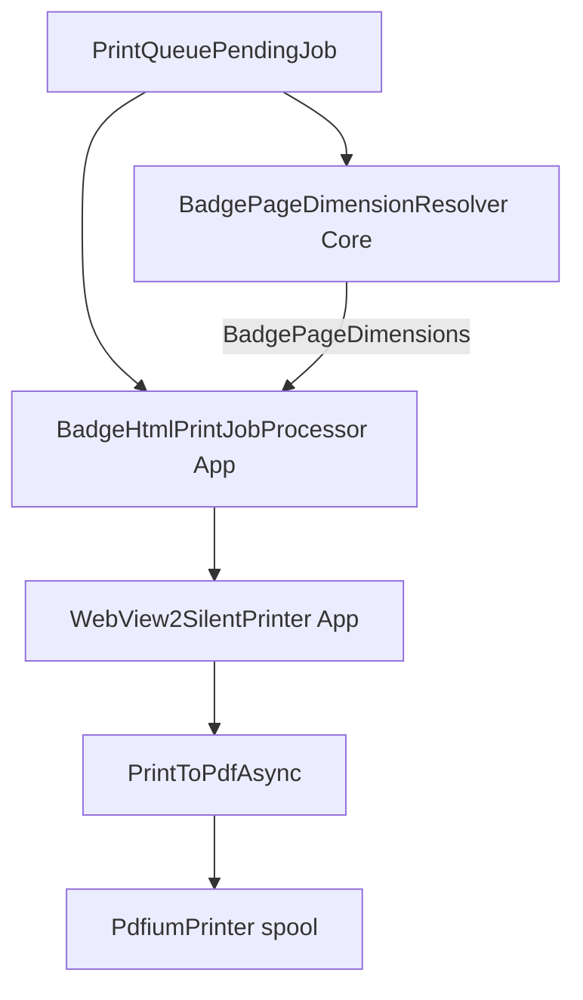

# Sprint 5 — Dynamic badge page size (BUG-003)

**Story:** W-01-S13 · **Sprint:** 5 · **Bug:** [BUG-003](../../BUGS.md#bug-003--relay-walk-in-badge-prints-smaller-than-designer-test-print-hardcoded-page-size)  
**Platform:** event-management-platform **BUG-011** (same symptom; Node relay may need a separate fix)  
**Sprint board:** [`SPRINT.md`](../../SPRINT.md#sprint-5--bug-003-dynamic-page-size-w-01-s13)  
**Acceptance:** [`BACKLOG.md`](../../BACKLOG.md) — W-01-S13

## Problem

Walk-in badges printed by the Windows relay are **smaller** than the designer **Print test badge** for the same event template. Root cause in this repo: `WebView2SilentPrinter` hardcodes CR80 page dimensions regardless of template.

```256:270:src/EventPlatform.PrintRelay.App/Printing/WebView2SilentPrinter.cs
        settings.PageWidth = RelayConstants.Cr80WidthInches;
        settings.PageHeight = RelayConstants.Cr80HeightInches;
```

W-01-S06 acceptance required dimensions from HTML `@page` / CSS; implementation never shipped that behaviour. Non-CR80 templates (A6 landscape, A5, custom mm) are squeezed into a CR80 PDF page — content scales down and prints smaller.

**Constraint:** Print `badge_html` only — never render layout from `badge_document`. Reading `physicalWidth` / `physicalHeight` from `badge_document` for **page size metadata** is allowed (same as Node relay `resolveBadgeFormatDimensions`); do not render elements from JSON.

---

## Target behaviour

| Priority | Source | When used |
|---|---|---|
| 1 | `badge_html` `@page { size: Wmm Hmm; }` | Primary — matches what WebView2 loads |
| 2 | `badge_document.template.canvas_config.format.physicalWidth` / `physicalHeight` | Fallback when `@page` missing or unparseable |
| 3 | `RelayConstants` CR80 (85.6 × 54 mm) | Final fallback — matches platform default preset |

Resolved dimensions flow: `BadgeHtmlPrintJobProcessor` → `WebView2SilentPrinter.PrintHtmlAsync(html, printer, dimensions)` → `CreatePrintSettings` + `ConfigureWebViewForPageLayout` (viewport px from mm at 96 dpi).

Log resolved width/height mm and source (`html`, `document`, `default`) on each print job line in `relay.log` — no HTML body, no secrets.

---

## Architecture



**Layering (per conventions):**

- **Core** — `BadgePageDimensions` record, `BadgePageDimensionResolver` (parse `@page`, read `badge_document` JSON path, fallback). Fully unit-tested on macOS CI.
- **App** — pass resolved dimensions into printer; log source in existing job activity.
- **Spike** — optional Session 3 alignment so `print-html` CLI uses same resolver (regression only).

---

## Out of scope

- Client-side badge layout from `badge_document` elements
- Changing platform `badge_html` renderer (platform BUG-011 may still need Node relay work)
- MSI rebuild / release tag (ship as app fix on next publish; no installer change)
- Printer driver-specific scaling overrides
- ARM64 Windows

---

## Implementation sessions

Sessions are sized for **single agent conversations** (context window limits). Each session touches a **bounded file set**; do not start the next session until the prior session's Mac CI is green (and Windows verify step is done when listed).

### Session 1 — Core dimension resolver + unit tests (Mac agent only)

**Goal:** Resolve mm page size from job payload without touching WebView2.

**In scope (≈4 files):**

| File | Action |
|---|---|
| `src/EventPlatform.PrintRelay.Core/Printing/BadgePageDimensions.cs` | New record: `WidthMm`, `HeightMm`, `Source` enum |
| `src/EventPlatform.PrintRelay.Core/Printing/BadgePageDimensionResolver.cs` | New static resolver |
| `tests/.../Printing/BadgePageDimensionResolverTests.cs` | xUnit: `@page` parse, `badge_document` path, CR80 fallback, invalid input |
| `tests/.../Fixtures/badge-page-samples.json` (optional) | Small HTML snippets + expected mm |

**Resolver rules:**

1. Regex parse `@page { … size: (\d+(?:\.\d+)?)mm (\d+(?:\.\d+)?)mm` from `badge_html` (case-insensitive; allow `size:` on its own line per platform renderer output).
2. If parse fails, read `badge_document` as `JsonElement`: `template.canvas_config.format.physicalWidth` / `physicalHeight` (positive numbers only).
3. Else return CR80 from `RelayConstants`.
4. Never throw on bad input — always return a valid dimension triple with source for logging.

**Out of scope this session:** `WebView2SilentPrinter`, App processor, Spike, Windows.

**Exit:** `dotnet test` green on macOS; no App publish needed.

---

### Session 2 — App print path wiring (Mac agent)

**Goal:** Production print uses resolved dimensions instead of hardcoded CR80.

**Depends on:** Session 1 merged.

**In scope (≈3–4 files):**

| File | Action |
|---|---|
| `src/EventPlatform.PrintRelay.App/Printing/WebView2SilentPrinter.cs` | `PrintHtmlAsync` accepts `BadgePageDimensions`; `CreatePrintSettings` / `ConfigureWebViewForPageLayout` use mm → inches |
| `src/EventPlatform.PrintRelay.App/Polling/BadgeHtmlPrintJobProcessor.cs` | Call resolver; pass dimensions to printer |
| `src/EventPlatform.PrintRelay.Core/Logging/RelayFileLogger.cs` (if needed) | Add `page_width_mm`, `page_height_mm`, `page_size_source` to job print activity |
| `DECISIONS.md` | Log: resolution order, no layout from `badge_document` |

**Out of scope this session:** Spike, staging E2E, physical measurement, MSI.

**Push** → operator **Session 2 Windows verify** (one step per reply):

1. Pull → publish → run relay.
2. Tray → **Print test badge** — still CR80 fixture; confirm print succeeds (no regression).
3. Staging walk-in or reprint on **CR80** template — compare to designer test print (same size eyeball or ruler).

**Exit:** Relay prints without error; `relay.log` shows resolved dimensions on job lines.

---

### Session 3 — Multi-format fixtures + Spike parity + staging doc (Mac agent)

**Goal:** Regression coverage for non-CR80 formats; operator checklist for sign-off.

**Depends on:** Session 2 merged.

**In scope (≈5–6 files):**

| File | Action |
|---|---|
| `src/EventPlatform.PrintRelay.App/Fixtures/test-badge-a6-landscape.html` | New — `@page { size: 148mm 105mm; }` matching `schemas/fixtures/pending-response.valid.json` |
| `src/EventPlatform.PrintRelay.Spike/Printing/WebView2SilentPrinter.cs` | Accept dimensions param (mirror App); or call shared helper |
| `src/EventPlatform.PrintRelay.Spike/Program.cs` | `print-html` optional `--width-mm` / `--height-mm` or auto-resolve from file |
| `tests/.../Printing/BadgePageDimensionResolverTests.cs` | Add A6 + custom mm cases from platform fixture |
| `docs/STAGING_INTEGRATION.md` | Add **dimension sign-off** subsection: CR80 + A6 compare vs designer test |
| `docs/SPIKE.md` | Note production uses dynamic size; Spike A5 remains for Gate 3 regression |

**Out of scope:** Windows physical sign-off (Session 4), CHANGELOG ship (Session 4).

**Exit:** `dotnet test` green; fixture HTML committed; staging doc updated.

---

### Session 4 — Windows physical sign-off + closure (Mac docs + Windows operator)

**Goal:** Confirm BUG-003 fixed on hardware; close sprint.

**Depends on:** Session 3 merged.

**Mac agent:**

- Mark W-01-S13 Done in `SPRINT.md` and `BACKLOG.md`
- Move BUG-003 to **Resolved** in `BUGS.md` with fix commit + version
- `CHANGELOG.md` Unreleased → fix bullet
- Note in BUG-003 whether platform BUG-011 still open for Node relay

**Windows operator** (one step per reply — see `windows-operator-steps.mdc`):

1. Pull latest → publish → confirm `git log -1` SHA.
2. **CR80 event:** designer test print vs walk-in relay print — same physical size (ruler or overlay).
3. **A6 landscape event** (or event using non-CR80 format): same comparison — walk-in must **not** be smaller than designer test.
4. Paste `relay.log` lines showing `page_width_mm` / `page_height_mm` / `page_size_source` for one job.

**Exit criteria (W-01-S13):**

- [ ] Resolver unit tests pass on CI
- [ ] CR80 and A6 (or other non-CR80) walk-in prints match designer test physical size on Windows hardware
- [ ] `relay.log` records resolved dimensions per job
- [ ] No client-side layout from `badge_document`
- [ ] Docs + bug log + changelog updated

---

## Session count summary

| Session | Where | Deliverable | Context budget |
|---|---|---|---|
| **1** | Mac agent | Core resolver + xUnit only | ~4 files, no UI |
| **2** | Mac agent + Windows verify | App WebView2 wiring + logging | ~4 files |
| **2a–2b** | Windows operator | Pull/publish + CR80 smoke | One step per reply |
| **3** | Mac agent | A6 fixture, Spike parity, staging doc | ~6 files |
| **4** | Mac + Windows | Physical sign-off, BUG-003 resolved | Docs + operator steps |

**Total:** 4 agent implementation sessions + 2 Windows verification rounds.

**Parallel sprints:** Sprint 5 does **not** block Sprint 3 (signing) or Sprint 4 (Kiosa icons). Prefer fixing BUG-003 before W-01-S10 physical sign-off matrix.

---

## Risks and mitigations

| Risk | Mitigation |
|---|---|
| `@page` parse diverges from platform HTML variants | Test against real `badge_html` from `schemas/fixtures/pending-response.valid.json`; add platform sample if parse fails |
| WebView2 `PrintToPdfAsync` still scales differently than browser `window.print()` | Session 4 physical compare; if mismatch persists on CR80 with correct mm, log follow-up bug (WebView2 vs browser) |
| `badge_document` missing format fields | Fallback to CR80 with `source: default`; log `used_fallback` equivalent |
| Platform BUG-011 is Node-only | Windows fix may resolve Windows desks; cross-link both bugs on closure |
| Pdfium spooler scales PDF to printer paper | Out of scope unless Session 4 shows correct PDF but wrong paper — then investigate `PdfSpooler` |

---

## Acceptance criteria (maps to W-01-S13 / BUG-003)

- [ ] `BadgePageDimensionResolver` in Core with xUnit coverage
- [ ] Resolution order: `@page` → `badge_document` format → CR80 default
- [ ] `WebView2SilentPrinter` uses resolved mm for `PageWidth` / `PageHeight` and viewport
- [ ] Walk-in badge physical size matches designer test print (CR80 + at least one non-CR80 format verified on Windows)
- [ ] `relay.log` includes dimension source per print job
- [ ] `BUGS.md`, `CHANGELOG.md`, `SPRINT.md`, `DECISIONS.md` updated on completion
